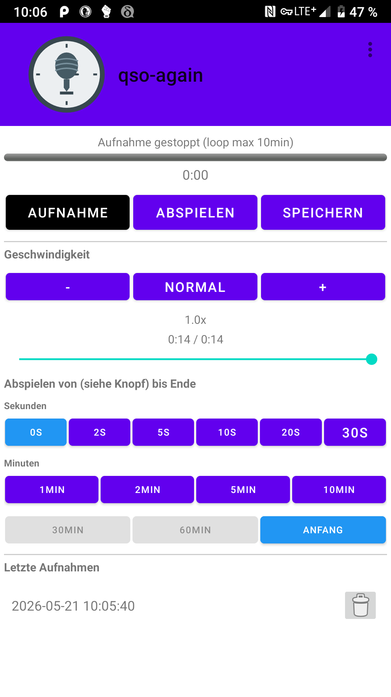
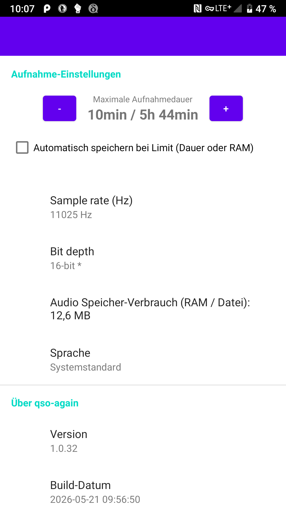

# QSO Again

Eine Android-App zur Aufnahme und Wiedergabe von Audio, speziell für Amateurfunk-QSOs (Funkgespräche).

## Funktionen
- Audioaufnahme mit Mikrofon
- Wiedergabe von Aufnahmen
- Verwaltung von Aufnahmedateien
- Hintergrundaufnahme mit Benachrichtigung
- **Audioloop**: Unendliche Audioaufnahme im RAM (keine Zwischenspeicherung auf Festplatte, Größe hängt vom verfügbaren RAM ab)
- **Schneller Rücksprung**: Springe über einen Button oder das Progressbar ein paar Sekunden zurück, um wichtige Passagen erneut zu hören

## Screenshots
<p>
  
  
</p>

## Build-Anweisungen
1. Klone das Repository:
   ```bash
   git clone https://github.com/dein-benutzername/qso-again.git
   cd qso-again
   ```

2. Baue die App mit Gradle:
   ```bash
   ./gradlew assembleRelease
   ```

Die generierte APK-Datei befindet sich in `app/build/outputs/apk/release/`.

## Abhängigkeiten
- AndroidX-Bibliotheken
- Material Design Components

## Lizenz
Diese App steht unter der GPLv3-Lizenz. Siehe die [LICENSE](LICENSE)-Datei für Details.